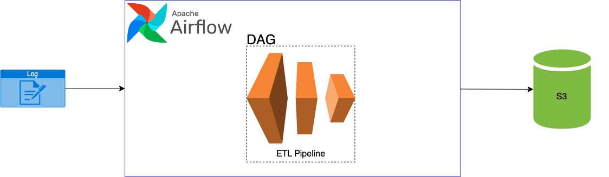

# ETL_Pipeline

## Architecture

## Issue
1. AWS S3에 적재할때 너무 많은 데이터 비용이 드는 문제 발생 
2. AWS S3에서 데이터 마다 디렉토리의 구분 필요
3. Airflow Webserver가 동작하지 않는 문제 발생

## Solution
1. gzip 모듈을 사용하여 압축률 28.06% -> 83.06% 달성 및 비용 문제 완화
2. Datetime을 사용하여 년/월/일/분 단위로 디렉토리 구분
3. AWS EC2 인바운스 규칙을 편집하여 해결

